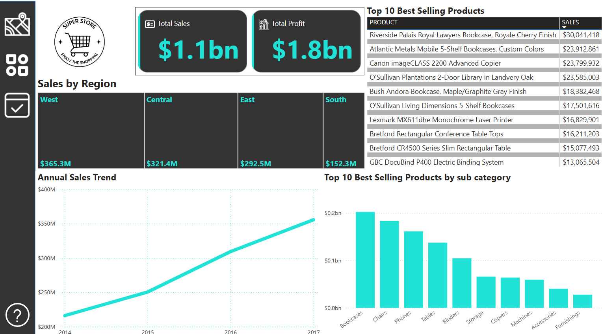
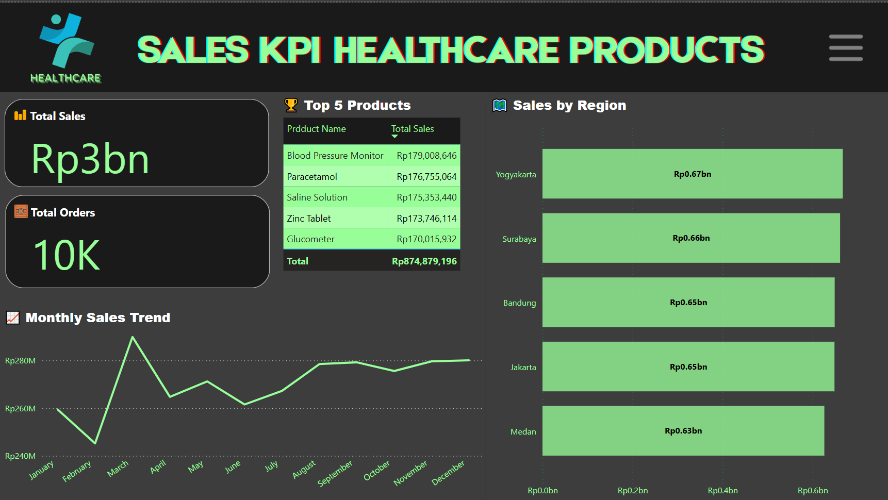

Hi, I’m Greg , a junior data analyst eager to turn numbers into clear, useful stories.
My current toolkit:

- SQL – writing queries for data extraction, cleaning, and summarization
- Microsoft Excel – intermediate formulas, pivot tables, dashboards to visualize insights
- Power BI – building interactive dashboards to visualize insights

[`Click here to view my certificate`](https://drive.google.com/drive/folders/1avT65JJJxh2_csxrnakQhcNg5m4B5PUu?usp=sharing)

---

# Here are some personal projects I have worked on:

# [1.📊 Customer Segmentation with RFM (PostgreSQL + Excel)](https://drive.google.com/drive/folders/14kiHvzyOFG51J7z-kCDdLrYsITSNIUMe?usp=drive_link)

This project applies the RFM (Recency, Frequency, Monetary) model to segment customers based on their purchasing behavior. Using SQL in PostgreSQL for data cleaning and metric calculation, followed by Excel for dashboard creation, the project provides actionable insights into customer value and engagement. The goal is to empower the marketing team with data-driven segmentation to tailor retention, reactivation, and upsell campaigns more effectively.

---

## 🧰 Tools Used

- **PostgreSQL** – For cleaning the data and calculating RFM scores using SQL
- **Excel** – For building dashboards using PivotTables and charts

---

## 🔄 Project Workflow

1. **Data Import and Cleaning**
   - Raw transaction data was imported from [`raw_data.csv`](https://drive.google.com/file/d/1SQtxGTd9Nks1p-Y-BsoHkard7gi4FnR1/view?usp=drive_link)
   - Data was cleaned and processed using SQL: [`cleaned_data.sql`](https://drive.google.com/file/d/1GTN4h0fKGRj--eYD-1lIOVgSOWmw4-bu/view?usp=drive_link)

2. **RFM Metrics Calculation**
   - **Recency**: How recently a customer made a purchase  
   - **Frequency**: How often a customer makes purchases  
   - **Monetary**: How much the customer spends

3. **Customer Segmentation**
   Customers were grouped into:
   - **Loyal**
   - **Regular**
   - **New**
   - **Lost**

4. **Dashboard Visualization**
   - Final data was exported to Excel and visualized in a dashboard: [`Visualization_OnlineRetail_Segmentation.xlsx`](https://docs.google.com/spreadsheets/d/1fCtCg8-T2IGCk9ooYXxtIsvgHNqHYSpx/edit?usp=sharing&ouid=110288971818370501017&rtpof=true&sd=true)
      

---

## 📁 File Structure

- `raw_data.csv` — Raw transaction data  
- `cleaned_data.sql` — SQL script for cleaning and RFM segmentation  
- `Visualization_OnlineRetail_Segmentation.xlsx` — Excel dashboard file  
- `rfm_dashboard.png` — Exported image of the dashboard  
- `README.txt` — Project description (this file)

---

## 📌 Key Insights

**💎 Loyal Segment:**
- Represents only ~12% of total customers
- But the highest share ($4.8M)
- High-value segment to retain and upsell

**👍 Regular Segment:**
- Largest in customer count (~60%)
- Contributes 36% of revenue ($3.0M)
- Strong potential for upsell and loyalty programs

**💤 Lost Segment:**
- Previously active but now inactive 
- Contributes ~5% of revenue
- Ideal target for reactivation campaigns

**🌱 New Segment:**
- Recently acquired or low-activity users
- Generates less than 1% of revenue
- Needs onboarding and engagement efforts

---

# [2.📊 Sales Performance Dashboard (Excel + Power BI) ](https://drive.google.com/drive/folders/1Ge4MCm3arTicQK0BQR6GeKtaVFo3zHZO?usp=sharing)

This project visualizes sales performance across multiple regions for a national retail company using Power BI. Cleaned and formatted in Excel, the dataset highlights key sales metrics such as revenue, profit, product performance, and regional trends. The interactive dashboard supports strategic decision-making through dynamic filtering and insights into top-performing products, underperforming regions, and seasonal sales patterns.

---

## 🛠 Tools Used

- **Excel** – For initial data cleaning and formatting  
- **Power BI** – For data modeling and dashboard creation  

---

## 🔄 Project Workflow

- Collected a sales dataset (e.g., from Kaggle)
- Cleaned and prepared the data in Excel:
  - Standardized date formats
  - Removed duplicates
  - Formatted currency fields
- Imported the cleaned dataset into Power BI
- Built relationships between tables (sales, products, customers)
- Created interactive visualizations:
  - 📦 Total Sales & Total Profit (Cards)
  - 🌍 Sales by Region (Treemap)
  - 📈 Sales Trend by Year (Line Chart)
  - 🏆 Top 10 Selling Products (Table)
  - 📊 Top 10 Products by Sub-Category (Bar Chart)
- Added slicers for dynamic filtering (e.g., by region, category, year)
- Exported the final dashboard to PDF for sharing

---

## 📈 Outputs

- [📁 Cleaned Excel Dataset](https://docs.google.com/spreadsheets/d/1hblZs4XdTkJnqLplfJCUtXqisTk0D6uT/edit?usp=drive_link&ouid=110288971818370501017&rtpof=true&sd=true)
- [📊 Power BI Dashboard (.pbix)](https://app.powerbi.com/view?r=eyJrIjoiYWY1MzA1NTYtZjcyOS00MmFjLTg2MGMtMGJhY2Y4ZWM1OWNiIiwidCI6IjM0ODViOTYzLTgyYmEtNGE2Zi04MTBmLWI1Y2MyMjZmZjg5OCIsImMiOjEwfQ%3D%3D)

  

---

## 📁 File Structure

- `Raw_SuperStore.csv` – Original dataset (optional)
- `cleaned_SuperStore.xlsx` – Cleaned and formatted data in Excel  
- `Dashboard superstore.pbix` – Power BI dashboard file  
- `Dashboard superstore.pdf` – Exported PDF version of the dashboard  
- `README.txt` – Project overview and documentation (this file)  

---

## 📌 Key Insights

💰 Revenue Drivers

- Top 10 products contribute around 17.5% of total revenue, indicating a long-tail distribution
- High-performing regions like West and Central consistently lead in annual sales

📉 Underperforming Regions

- Southern region contributes only ~13% of total sales
- Indicates potential for regional growth through tailored campaigns

📈 Seasonal Trends

- Sales peak in Q3 and Q4, especially Q4, making them crucial periods for inventory and marketing strategies
- Useful for planning inventory and promotional bursts

🏷 Category Trends

- Technology and Office Supplies lead in both volume and profit
- Sub-category performance varies by region

---

# [3. 📊 Sales KPI Dashboard (PostgreSQL + Power BI)](https://drive.google.com/drive/folders/1sQtYUZ8_jwPQG_HOcTILeL1pKkWmVZRu?usp=sharing)

This project visualizes key sales metrics of pharmacy products stored in a PostgreSQL database using Power BI. It enables real-time monitoring of sales performance across products, regions, and sales personnel. The interactive dashboard highlights total revenue, monthly trends, regional breakdowns, and top-performing pharmacy items, supporting data-driven decisions and strategic planning.

---

## 🛠 Tools Used

- **PostgreSQL** – For storing and querying sales data
- **Power BI** – For data visualization and interactive dashboards  

---

## 🔄 Project Workflow

- Created a `sales_data` table in PostgreSQL and imported raw sales data
- Connected Power BI to PostgreSQL using the native connector
- Built calculated fields such as:  
  - `total_sales = quantity * price`
- Developed key visual components:
  - **💰 Total Sales (Card): Displays the total value of all product sales
  - **📦 Total Orders (Card): Shows the total number of orders placed
  - **📈 Monthly Sales Trend (Line Chart):** Tracks sales patterns and seasonality
  - **📍 Sales by Region (Bar Chart):** Compares sales performance across cities or regions
  - **🏆 Top 5 Products (Table):** Lists highest-revenue Healthcare products
- Added slicers for dynamic filtering by Region and Salesperson
- Designed a clean, intuitive dashboard for exploration and insights

---

## 📈 Outputs

- [🧾 Sales Raw Data (.xls)](https://drive.google.com/file/d/1Q4Re1_XqnJzNR89yZwsTfiWcq9QV3lcP/view?usp=sharing)
- Final dashboard to visualize Sales KPI data for Healthcare Products: [`Sales_KPI_HealthcareProducts.pbix`](https://app.powerbi.com/view?r=eyJrIjoiM2NjZTcwNjktNjEyNi00NmE3LWI0ODUtZmNjNjZmNDAwOGNkIiwidCI6IjM0ODViOTYzLTgyYmEtNGE2Zi04MTBmLWI1Y2MyMjZmZjg5OCIsImMiOjEwfQ%3D%3D)
      
---

## 📁 File Structure

- `sales_raw_data.csv` – Raw sales dataset (optional)  
- `sales_data.sql` – SQL script to create and populate the PostgreSQL table  
- `sales_kpi_dashboard.pbix` – Power BI dashboard file  
- `sales_dashboard.pdf` – Exported PDF of the dashboard  
- `README.txt` – Project description and documentation (this file)  

---

## 📌 Business Insights

🧭 Real-Time Monitoring

- Dashboard allows dynamic tracking by region & salesperson
- Enables fast decision-making for daily sales ops

🏆 Top Performers

- 5 products generate over 50% of revenue
- Strong correlation between specific regions and top-performing items

📍 Regional Opportunities

- All regions contribute more than 19% to total revenue
- Focus can shift toward strategy equalization and deeper market penetration in similar-performing regions

📆 Sales Trends

- Clear monthly patterns indicate opportunities for seasonal planning
- Historical data useful for forecasting and goal-setting

---

# [4.🛫 Flight Delay Pattern Analysis (PostgreSQL)](https://drive.google.com/drive/folders/1MXeQxYQi35s5fXh0HCIanZ6AdAGkCxbR?usp=sharing)

This project analyzes U.S. flight delay data using structured SQL scripts in PostgreSQL. It focuses on importing, cleaning, and analyzing a raw dataset (DelayedFlights.csv) containing over 1 million flight records. The analysis includes identifying common delay patterns, airline performance, airport congestion, and cancellation trends—all done entirely within SQL, without the use of BI or visualization tools.

---

## 🧰 Tools Used
- **PostgreSQL** – For importing data, data cleaning, and advanced SQL queries
- **Kaggle Dataset** – Airline Delays: [Link](https://www.kaggle.com/datasets/giovamata/airlinedelaycauses)

---

## 🔄 Project Workflow

### 🗃️ Data Import & Setup
- Dataset: `DelayedFlights.csv` (~1.2M rows)
- Created PostgreSQL table `flight_delays` with appropriate data types (mostly `NUMERIC`)
- Used `COPY` command to import CSV safely, handling nulls and decimals

### 🧹 Data Cleaning, Enhancement & Manipulate
- Renamed columns for clarity using snake_case (e.g., arr_time → arrival_time)
- Converted raw time formats (e.g., 1425 → 14:25) for human readability
- Formatted delay durations from minutes to "X hr Y min" strings
- Mapped numeric day_of_week to day names (Monday, Tuesday, etc.)
- Selected only relevant and meaningful columns for analysis
- Preserved original data structure (non-destructive transformation)
- Renamed columns for clarity (snake_case)
- Added calculated columns:
  - `flight_date` from year, month, day
  - `is_delayed` (boolean if arrival delay > 15 minutes)

### 📊 Data Analysis (SQL Only)
- Top 10 busiest origin airports by delay
- Average delay by airline
- Trend of delays per hour block (derived from dep_time)
- Cancellation rate analysis
- Breakdown of delay causes: weather, carrier, NAS, etc.

### 📋 Sample Queries
```sql
-- Average delay per airline
SELECT unique_carrier, ROUND(AVG(arr_delay), 2) AS avg_delay
FROM flight_delays
WHERE arr_delay IS NOT NULL
GROUP BY unique_carrier
ORDER BY avg_delay;

-- Hourly pattern of departure delays
SELECT FLOOR(dep_time / 100) AS hour, COUNT(*) FILTER (WHERE dep_delay > 15) AS delay_count
FROM flight_delays
GROUP BY hour
ORDER BY hour;
```

---

## 📁 File Structure
- `DelayedFlights.csv` — Raw dataset from Kaggle
- `Flight_Delayed_Cleaned.csv` — Dataset that has been cleaned and manipulated
- `Create_Table_Flight_Delay.sql` — SQL script for table creation
- `Data Cleaning & Enhancement.sql` — SQL script for column renaming and data enhancement
- `Data Manipulation ( Easy To Read Data ).sql` — SQL script for manipulating data to make it easier to read
- `flight_analysis_queries.sql` — Collection of analysis queries
- `README.txt` — Project description and documentation (this file)  

---

## 📌 Key Insights

✈️ **Busiest Airports with Delay**  
Hubs like ATL, ORD, and LAX experience the highest number of delays — mostly in peak evening hours.

🧭 **Hourly Delay Pattern**  
Delays tend to spike between 5–8 PM, especially on Friday evenings.

☁️ **Main Delay Causes**  
Late aircraft and carrier-related issues account for more than 60% of delays.

🏆 **Top On-Time Airlines**  
Airlines like Hawaiian and Alaska showed the lowest average arrival delays in the dataset.
