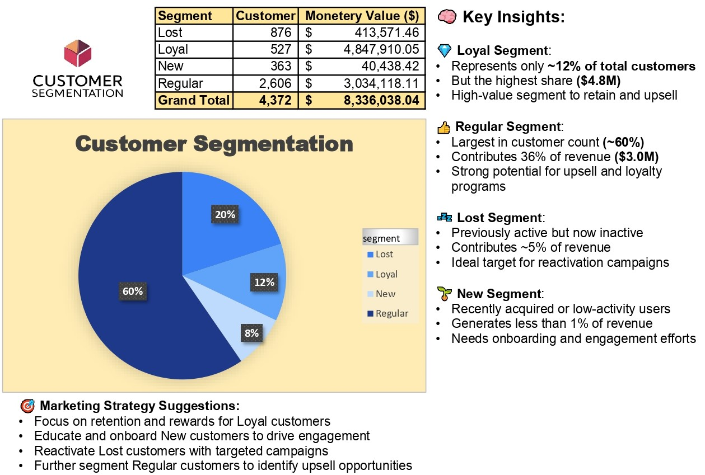

Hi, I’m Greg , a junior data analyst eager to turn numbers into clear, useful stories.
My current toolkit:

- SQL – writing queries for data extraction, cleaning, and summarization
- Microsoft Excel – intermediate formulas, pivot tables, basic VBA macros, dashboards to visualize insights
- Power BI – building interactive dashboards to visualize insights

# [1.📊 Customer Segmentation with RFM (PostgreSQL + Excel)](https://drive.google.com/drive/folders/14kiHvzyOFG51J7z-kCDdLrYsITSNIUMe?usp=drive_link)

This project focuses on segmenting customers based on their purchasing behavior using the **RFM (Recency, Frequency, Monetary)** method. The goal is to help the marketing team create more targeted and effective campaigns using data-driven insights.

---

## 🧰 Tools Used

- **PostgreSQL** – For cleaning the data and calculating RFM scores using SQL
- **Excel** – For building dashboards using PivotTables and charts

---

## 🔄 Project Workflow

1. **Data Import and Cleaning**
   - Raw transaction data was imported from [`raw_data.csv`](https://drive.google.com/file/d/1SQtxGTd9Nks1p-Y-BsoHkard7gi4FnR1/view?usp=drive_link)
   - Data was cleaned and processed using SQL: [`cleaned_data.sql`](https://drive.google.com/file/d/1GTN4h0fKGRj--eYD-1lIOVgSOWmw4-bu/view?usp=drive_link)

2. **RFM Metrics Calculation**
   - **Recency**: How recently a customer made a purchase  
   - **Frequency**: How often a customer makes purchases  
   - **Monetary**: How much the customer spends

3. **Customer Segmentation**
   Customers were grouped into:
   - **Loyal**
   - **Regular**
   - **New**
   - **Lost**

4. **Dashboard Visualization**
   - Final data was exported to Excel and visualized in a dashboard: [`rfm_dashboard.xlsx`](https://docs.google.com/spreadsheets/d/1m3LPRdzmRKLK7wDkkPmdov1O3R52GVE1/edit?usp=drive_link&ouid=110288971818370501017&rtpof=true&sd=true)
      

---

## 📁 File Structure

- `raw_data.csv` — Raw transaction data  
- `cleaned_data.sql` — SQL script for cleaning and RFM segmentation  
- `rfm_dashboard.xlsx` — Excel dashboard file  
- `rfm_dashboard.png` — Exported image of the dashboard  
- `README.md` — Project description (this file)

---

# [2.📊 Sales Performance Dashboard (Excel + Power BI) ](https://www.example.com)

This project visualizes sales performance across multiple regions for a national retail company. The dashboard is designed to support **strategic decision-making** by showcasing key sales metrics and trends through interactive visualizations.

---

## 🛠 Tools Used

- **Excel** – For initial data cleaning and formatting  
- **Power BI** – For data modeling and dashboard creation  

---

## 🔍 What We Did

- Collected a sales dataset (e.g., from Kaggle)
- Cleaned and prepared the data in Excel:
  - Standardized date formats
  - Removed duplicates
  - Formatted currency fields
- Imported the cleaned dataset into Power BI
- Built relationships between tables (sales, products, customers)
- Created interactive visualizations:
  - 📦 Total Sales & Total Profit (Cards)
  - 🌍 Sales by Region (Map or Treemap)
  - 📈 Sales Trend by Year (Line Chart)
  - 🏆 Top 10 Selling Products (Table)
  - 📊 Top 10 Products by Sub-Category (Bar Chart)
- Added slicers for dynamic filtering (e.g., by product, region)
- Exported the final dashboard to PDF for sharing

---

## 📈 Outputs

- [📁 Cleaned Excel Dataset](https://docs.google.com/spreadsheets/d/1hblZs4XdTkJnqLplfJCUtXqisTk0D6uT/edit?usp=drive_link&ouid=110288971818370501017&rtpof=true&sd=true)
- [📊 Power BI Dashboard (.pbix)](https://app.powerbi.com/view?r=eyJrIjoiYzlmZWM2MjEtOGJjOS00M2YyLTg0MWEtYmFmYTRlZThkMmFmIiwidCI6IjM0ODViOTYzLTgyYmEtNGE2Zi04MTBmLWI1Y2MyMjZmZjg5OCIsImMiOjEwfQ%3D%3D)
  

---

## 📁 File Structure

- `sales_raw_data.csv` – Original dataset (optional)
- `cleaned_sales_data.xlsx` – Cleaned and formatted data in Excel  
- `sales_dashboard.pbix` – Power BI dashboard file  
- `sales_dashboard.pdf` – Exported PDF version of the dashboard  
- `README.md` – Project overview and documentation (this file)  

---

## 📌 Business Insights

This dashboard provides insights such as:
- Top-performing products and categories
- Regions contributing most to sales and profit
- Seasonal or annual sales trends
- Opportunities for growth in underperforming areas

---

> 📬 For questions or collaboration, feel free to contact me on [LinkedIn] or via email.
